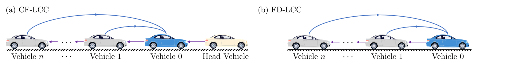
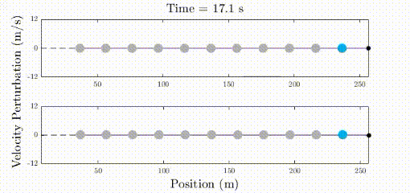
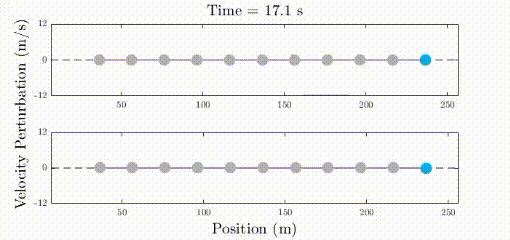

# Demos for LCC in mixed traffic

In this project, we present a few demos of LCC in mixed traffic systems

## Leading Cruise Control (LCC)
Leading Cruise Control is a general control framework for connected and autonomous vehicles (CAVs) in mixed traffic flow, where human-driven vehicles (HDVs) also exist. A schematic diagram is shown below.

The blue arrows represent the communication topology of the CAV, while the purple arrows illustrate the interaction direction in HDVs' dynamics. The blue vehicles, gray vehicles and yellow vehicles represent CAVs, HDVs and the head vehicle, respectively.

Two special cases of LCC are **Car-Driving LCC (CF-LCC)** and **Free-Driving LCC (FD-LCC)**.

(Demo scenario: the CAV responds to the motion of the two HDVs directly behind)

## Features
The CAV maintains car-following operations, adapting to the states of its preceding vehicles, and it also aims to **lead the motion of its following vehicles**. Specifically, by controlling of the CAV, LCC aims for both of the following two objectives:

1. **attenuate downstream traffic perturbations**;
2. **smooth upstream traffic flow**.

## Publications
1. Wang, J., Zheng, Y., Chen, C., Xu, Q., & Li, K. (2020). Leading Cruise Control in Mixed Traffic Flow: System Modeling, Controllability, and String Stability. arXiv preprint arXiv:2012.04313. [link](https://arxiv.org/abs/2012.04313)
2. Wang, J., Zheng, Y., Chen, C., Xu, Q., & Li, K. (2020). Leading cruise control in mixed traffic flow. 59th IEEE Conference on Decision and Control, 2020. [link](https://arxiv.org/abs/2007.11753)

See [here](https://wangjw18.github.io/files/2020-CDC-slides.pdf) for presentation slides.

## Contacts
Relavent project: [mixed-traffic](https://github.com/wangjw18/MCMT) (modeling and control of mixed traffic flow).
