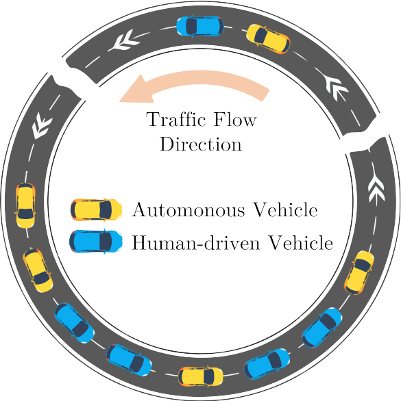

<!-- _coverpage.md -->

# Mixed Traffic Control

> Modeling and Control of Mixed Traffic Flow.

- Coexistence of autonomous vehicles and human-driven vehicles;
- Rigorous analysis of fundamental properties of system dynamics;
- Optimal control of AVs to improve the entire traffic performance.

[GitHub](https://github.com/wangjw18/LCC)
[Get Started](home.md)
